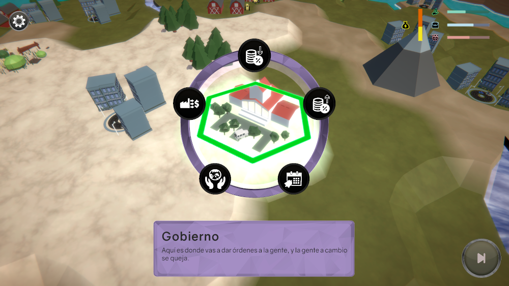
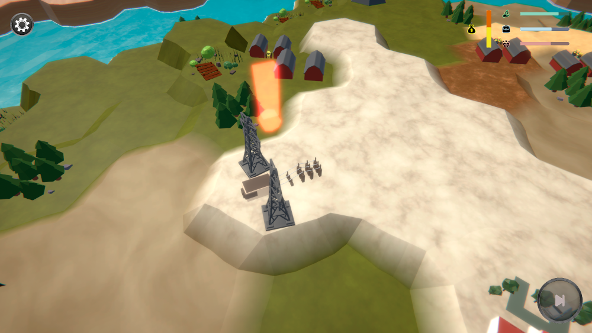
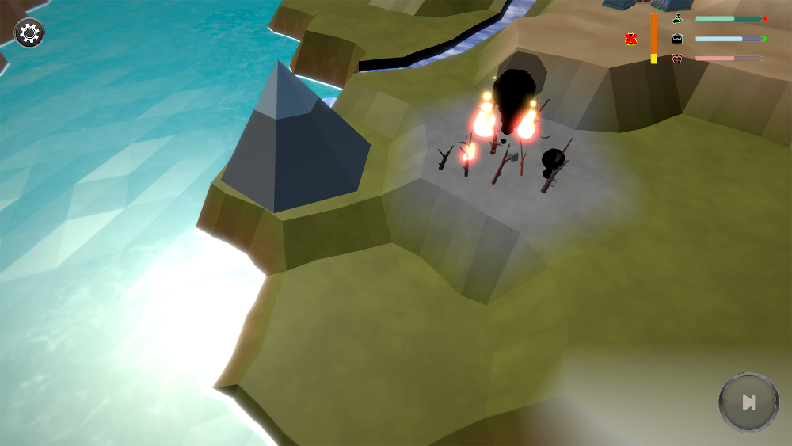

## This can be your internal website page / project page

**Project description:** In ECORRUPTION you are the recently elected leader of your country. Now that you hold the power you must keep it by balancing three elements: Environment, Population and Business. 

### 1. Suggest hypotheses about the causes of observed phenomena

Sed ut perspiciatis unde omnis iste natus error sit voluptatem accusantium doloremque laudantium, totam rem aperiam, eaque ipsa quae ab illo inventore veritatis et quasi architecto beatae vitae dicta sunt explicabo. 

```javascript
if (isAwesome){
  return true
}
```





For more details see [GitHub Flavored Markdown](https://guides.github.com/features/mastering-markdown/).
