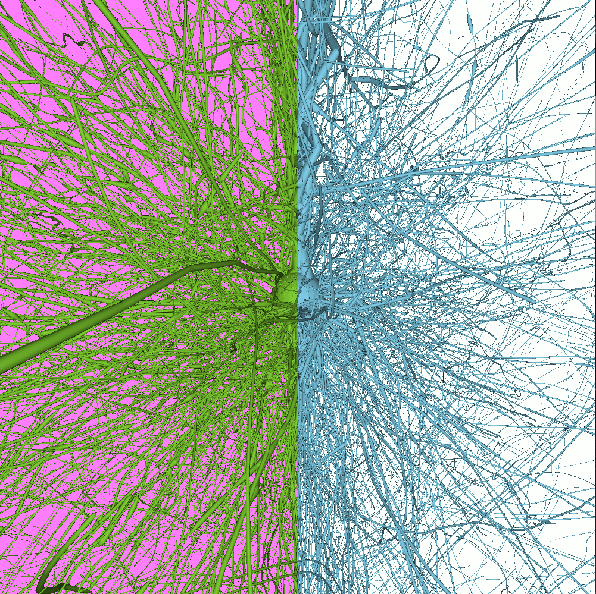

## Portfolio

---
### [Master's thesis: MultiGPU Rendering](/tfm_page)

### [ECORRUPTION](/ecorruption_page)

---
### [OpenGL renderer](/opengl_page)

---
### [Vulkan renderer (WIP)](/vulkan_page)

---

### Web development work
[A](/pgatr/index.html)

- [Glissandoo](https://glissandoo.com/)

---

---

Page template forked from <a href="https://github.com/evanca/quick-portfolio">evanca</a>

<!-- Remove above link if you don't want to attibute -->
